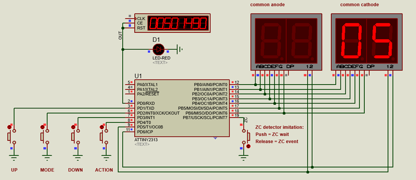

# spotter_2_attiny2313
Firmware for the ATtiny2313 microcontroller used in the spot welding timer. 
 
Using with common cathode LED indicator: 

 
Using with common anode LED indicator: 

## Tools:
Compile: AVR Studio 5 
Modeling (optional): Proteus 8.11+

## Link
http://whitearc.ru/devices/spotter_controller_2
